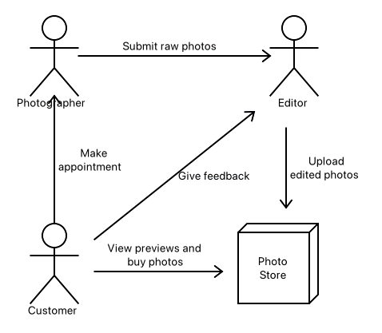
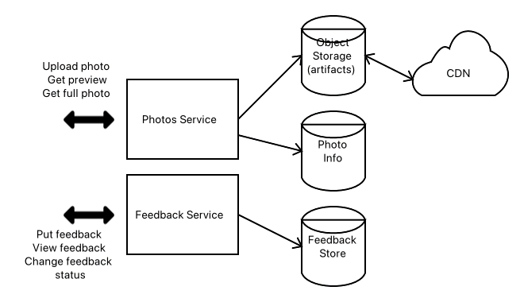
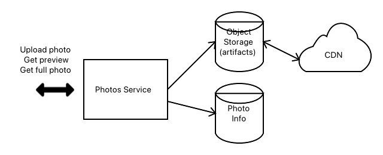
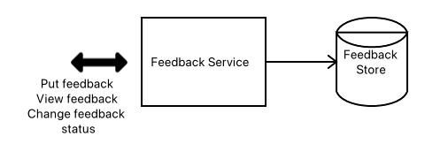

# Domain Driven Design Blog

Assignment #3

CIS 4360-005

Evan Fiordeliso

---

### Table of Contents
- [Business Problem or Opportunity](#business-problem-or-opportunity)
- [Main Domain Events](#main-domain-events)
    - [Sub-Teams](#sub-teams)
- [Sub-Team](#sub-team)
    - [Requirements](#requirements)
    - [Architectural Design](#architectural-design)
        - [Photos Service](#photos-service)
        - [Feedback Service](#feedback-service)

---

# Business Problem or Opportunity
Our business is a large photography studio that handles 
customers on an appointment basis. The studio handles 
appointments for in-studio or out-of-studio photos-shoots as 
well as professional editing to tailor the photos to the 
customer’s liking. There is an approval process in place for 
allowing customers to make changes to the photos when the 
need arises. Approved photos can be purchased as either 
prints or for digital download.

# Main Domain Events

This photo demonstrates the general flow of the business’ 
operations. The process starts with a customer making an 
appointment with a photographer through an online scheduling 
portal. The photos from the photo-shoot are then sent to the 
team of editors to professionally edit them which are 
uploaded into a photo store. The customer can then review 
the previews from the edited photos and either approve them 
or make requests for changes or additions. The editor will 
then make the requested changes then re-upload the new 
photos for the customer to review again. Once the customer 
is satisfied with the resulting photos they can order them 
for digital download or prints to be mailed to them.

## Sub-Teams
- Appointments and Scheduling
- Photos and Feedback
- Prints Ordering

# Sub-Team
The sub team I will focus on is the Photos and Feedback 
sub-team. This sub-team’s responsibility is to create the 
systems to handle the edited photos and previews as well as 
the feedback process for said photos.
## Requirements
- Must allow for photo editors to submit the edited photos
- Must allow for customer to access previews of the edited photos
- Must allow for the customer to approve or request changes to photos
- Must allow for the photo editors to re-submit the updated photos and mark changes as completed

## Architectural Design

This is the overall architecture design for the Photos and 
Feedback sub-team.

### Photos Service

This is the architecture of the photos service. The photos 
service will expose three endpoints: one for uploading a 
photo, one for getting a preview of a photo, and the last 
one for getting a full photo.

The actual photos will be stored in an object storage which 
will also be sent to a content delivery network (or CDN) for 
quicker access from around the globe. The metadata for the 
photos will be stored in a key/value database.

### Feedback Service

This is the architecture of the feedback service. The 
feedback service will expose three endpoints: one for 
submitting feedback, one for retrieving feedback, and the 
last one for changing the status of the feedback. This 
feedback will be stored in a key/value database.

This service should not need access to the Photos Service
but it could be possible that it would need information
about the photo the feedback is for.