# AWS Exploration Blog

Assignment #1

CIS 4360-005

Evan Fiordeliso

---

### Table Of Contents

- [Exploration](#exploration)
    - [Create EC2 Instance](#create-ec2-instance)
    - [Setup NodeJS Hello World Program](#setup-nodejs-hello-world-program)
- [Cloud Platforms and Microservices](#cloud-platforms-and-microservices)

---

## Exploration

### Create EC2 Instance

The first thing I did was open up the Amazon Web Services (AWS) console and selected "Launch a virutal machine" to spin up a new EC2 instance. The first step in the setup process was to choose the operating system for the virtual machine and I chose Amazon Linux 2 AMI as it seems like it would be a good choice considering it is made for this platform specifically and it's free-tier supported.

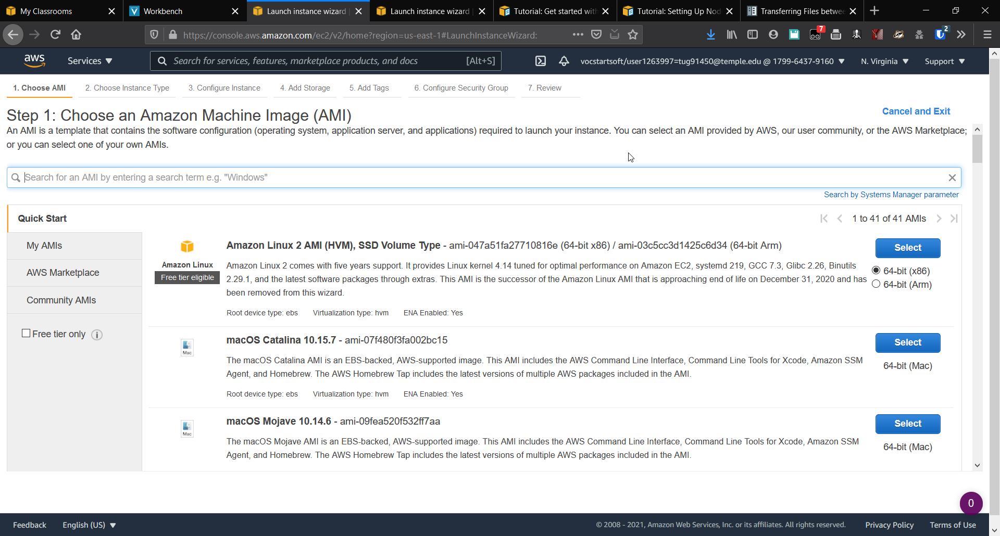

The next step was to choose the instance type and t2.micro was the only option for a free tier instance so I chose that.

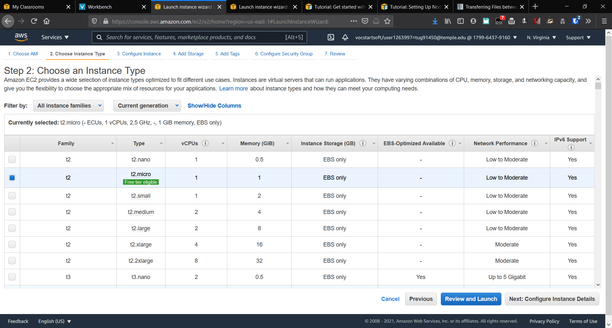

After that I was able to review and launch the EC2 instance, however I was following a tutorial from Amazon and it said you need to configure the ports necessary for the instance. This is done in the page to configure security groups. It was very easy to add the new ports as I just needed to click add rule and from the drop down menu in the type column select HTTP and HTTPS. SSH was already pre-configured for me.

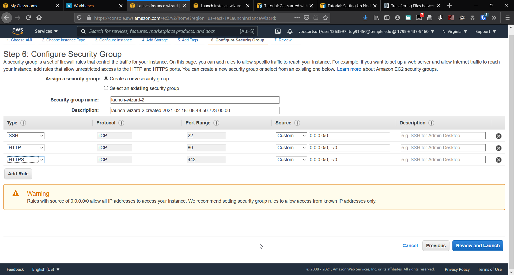

Once I finished that I could check the review page to see if everything was configured correctly.

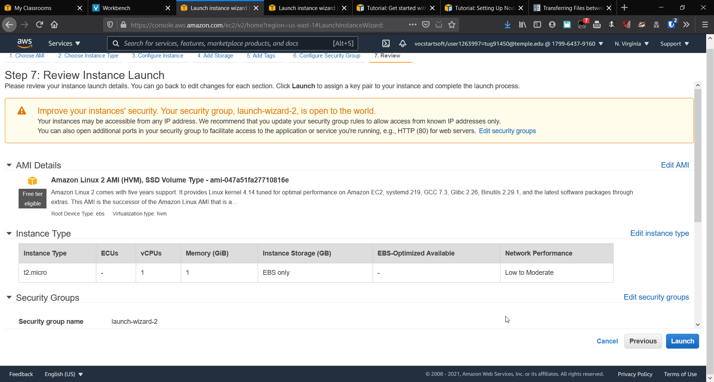

Everything looked good so I decided to launch the instance and get started on making a quick hello world program. I noted down the address needed to access the instance for later as this would be necessary for connecting to it. This information was easily available on the instance's summary page.

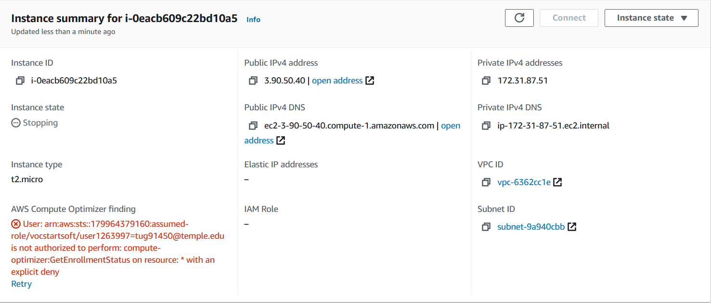

### Setup NodeJS Hello World Program

One thing I forgot to note is that when I launched the instance it asked to create a public/private key pair to be able to ssh into the server. I downloaded this to my computer and setup the SSH remote information in the OpenSSH config file.

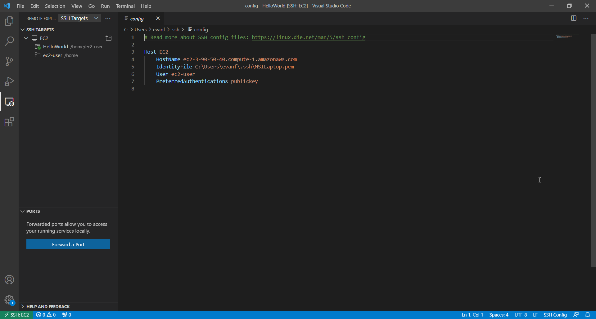

As you can see in the bottom left corner of that screenshot I am also connected to the instance as this screenshot was taken after I successfully connected. VSCode allows for you to connect to remote hosts to easily manage files, edit the code, and use the terminal all in one program. The next step I needed to take was install node.js on the remote server to be able to run the hello world program. This was fairly simple and just required installing Node Version Manager (NVM) with one command then installing node via that.

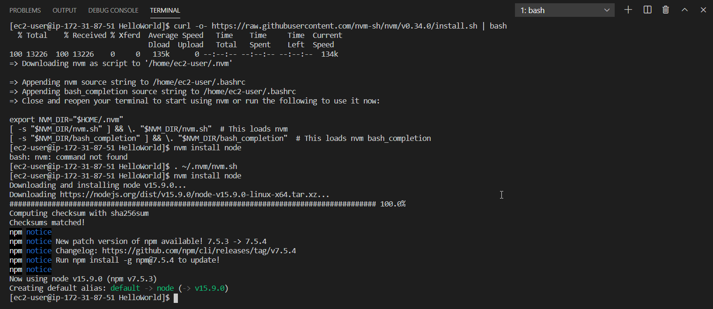

After that I had to setup the Node Package Manager (NPM) to be able to download and install dependencies for the hello world application. For this application I only needed one dependency and that was expressjs which is a simple web application library. I didn't show the installation process for that in this picture but it's as easy as `npm install express` after I had setup npm.

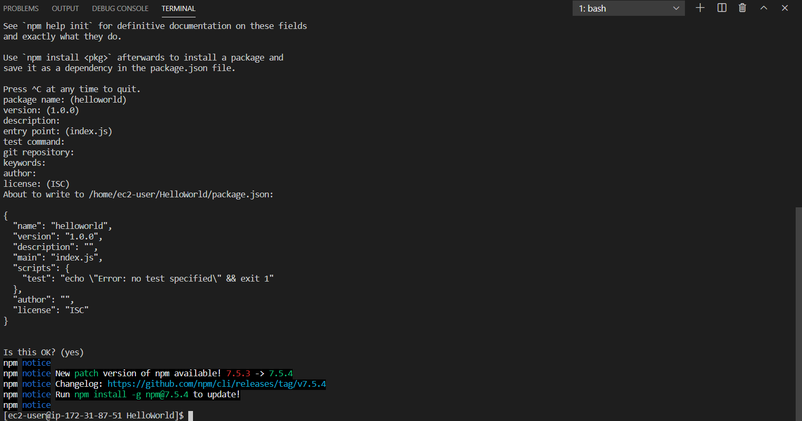

The following screenshot is the basic hello world applicationm that I built. It is not exactly the same as the actual code that I used, the only thing that I changed was not hard coding the host and port in the console.log line, instead they are in variables.

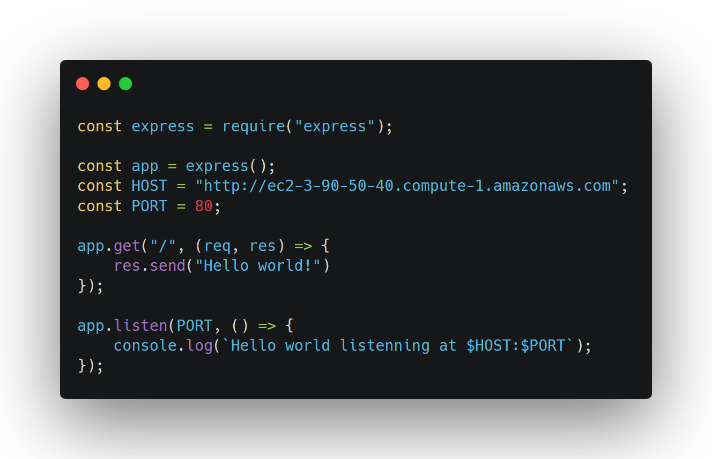

I had issues with running the code becuase initially I chose port 3000 but that port wasn't configured in the EC2 instance so I had to change it to port 80. When I started the server I had an access error.

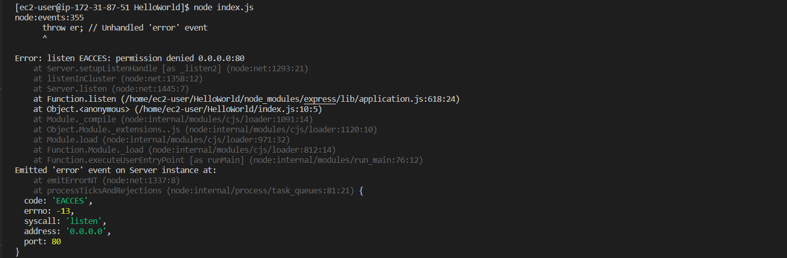

I tried to use sudo to start the server instead but it could not find the command "node" so I looked it up online and it appears I needed to make a symbolic link for the node application into the /usr/bin folder for sudo to be able to find it.

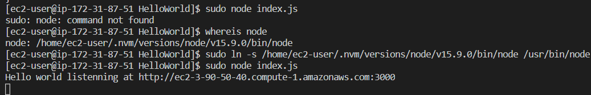

Once I did that, `sudo node index.js` worked just fine and the server was able to start up as you can see in the above screenshot. As I noted above the port was hardcoded into the console.log string so while the console says it is listening on port 3000 it was actually listening on port 80. Below you can see the application in action.

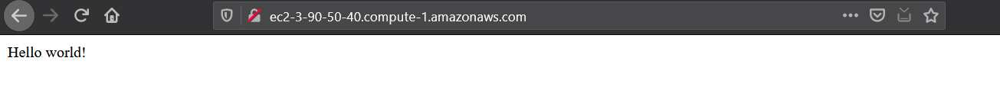

## Cloud Platforms and Microservices

The benefits of using a cloud platform to implement a
microservice architecture are clear when considering the
properties of the architecture. One of the main properties
is scalability, the ability for the application to grow or
shrink depending on the needs of the client. By using a
cloud platform, it would be rather easy to obtain more
resources required to scale the application up. Also with
many platforms you only pay for what you use so allocating
resources to the more important parts of the system makes
it more cost effective to run.

There are also cloud platforms that come with specific
features designed to make implementing a microservice
architecture easier. AWS has such a feature that they call
AWS Lambda. With these features being designed specifically
for microservices it makes implementing the architecture
far easier as you don't have to put together the part that
will host the microservice as it is handled for you. Also
this feature is designed to integrate well with their other
features allowing for easy and seamless communication with
the parts of the system as needed.

Even if the cloud platform of choice does not have a specific
feature designed around microservices, there often is a way
to implement it using containerization. Containerization is
the process of bundling an application with all of the 
configuration files, libraries, and dependencies needed to
have the application run. The most popular containerization
ecosystems, Docker and Kubernetes, are well supported by many
cloud platforms. This allows for easily deploying a
microservice with all of the things it needs to run.

As you can see, cloud platforms offer many benefits when it
comes to a microservice architecture and it seems like an 
obvious choice when choosing to implement it.