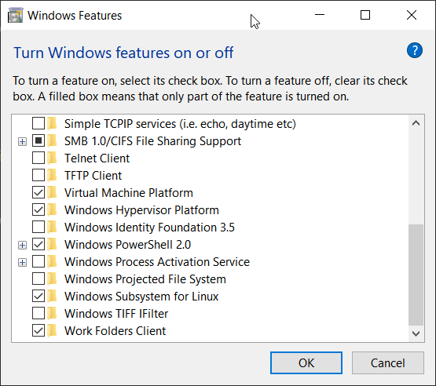
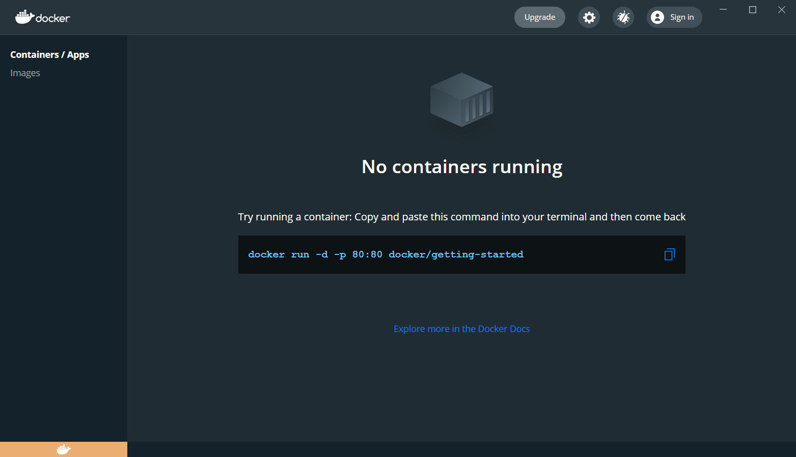
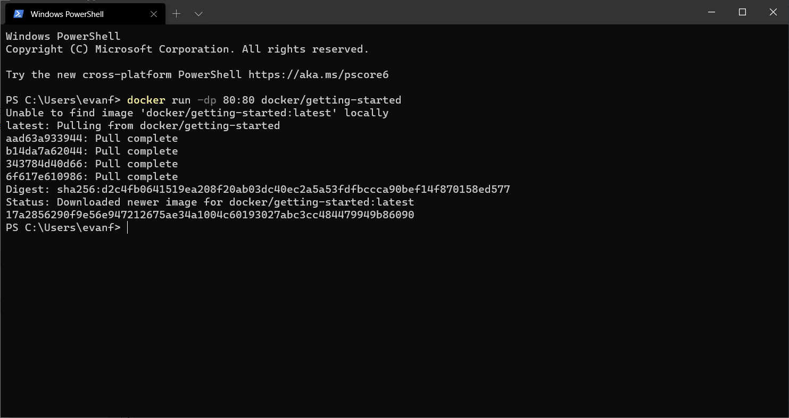
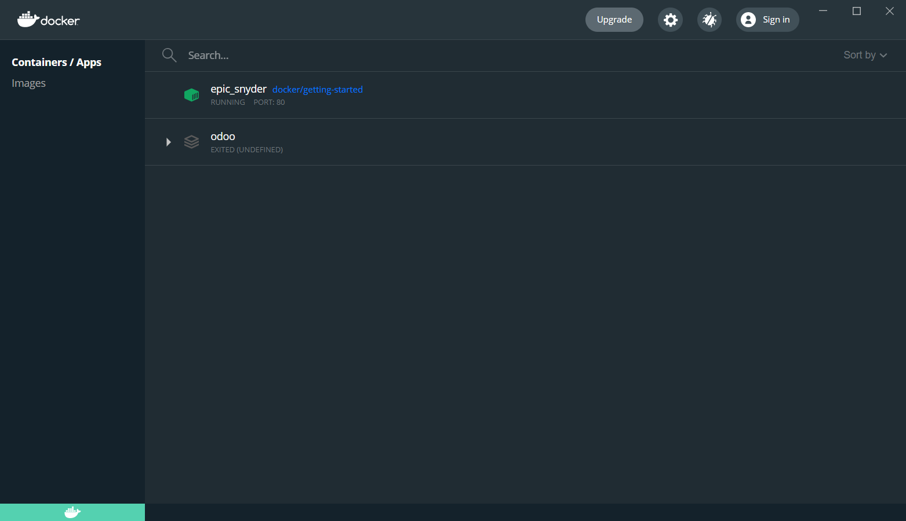
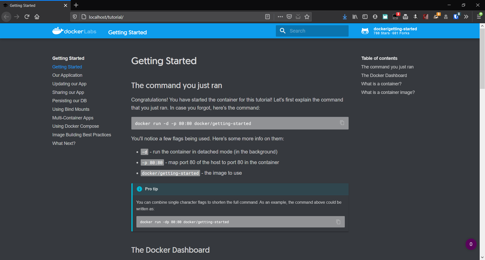

# Case Study Selection

Assignment #6

CIS 4360-005

Evan Fiordeliso

Partner: Stephanie Minnis

---

### Table of Contents
* [Installing Docker](#installing-docker)
* [Analysis of Docker](#analysis-of-docker)

---

## Installing Docker

Having done a little bit of research on running docker
on Windows, I knew I had to enable Windows Subsystem
for Linux to be able to use docker desktop. This is
because Windows 10 Home does not support certain
features of hypervisor that are available on Pro and
Enterpreise versions. Also I had updated to WSL
version two using the command `wsl 
--set-default-version 2`. Below you can see the Windows
features page with the WSL feature enabled.

Next I installed and started docker desktop and was
able to see the getting started page.

I ran the example command in the command prompt and it
downloaded and started the getting started image.

Here you can see the container running within the docker
deskop application. (The other container was me playing
around on docker desktop a few weeks ago)

Below you can see the page that is hosted by the server 
image loading successfully.

## Analysis of Docker

With docker on windows, it needs to be able to run a 
virtual machine for the docker containers to run on,
in Windows 10 Home it uses WSL and for Windows 10 Pro
and Enterprise it uses Hyper-V. You can then download
images and create containers within this virtual
environment from the command line on your windows
machine and it will start the containers in this virtual
environment.